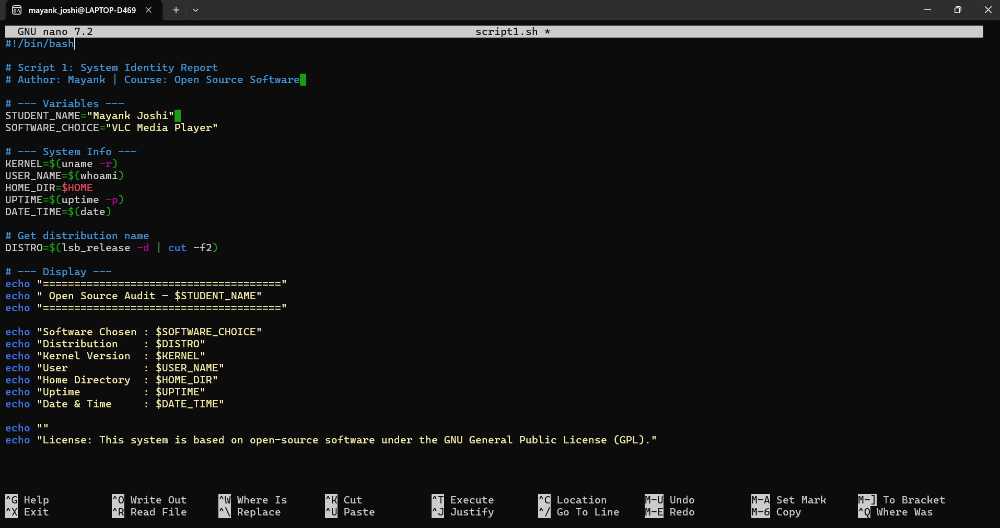
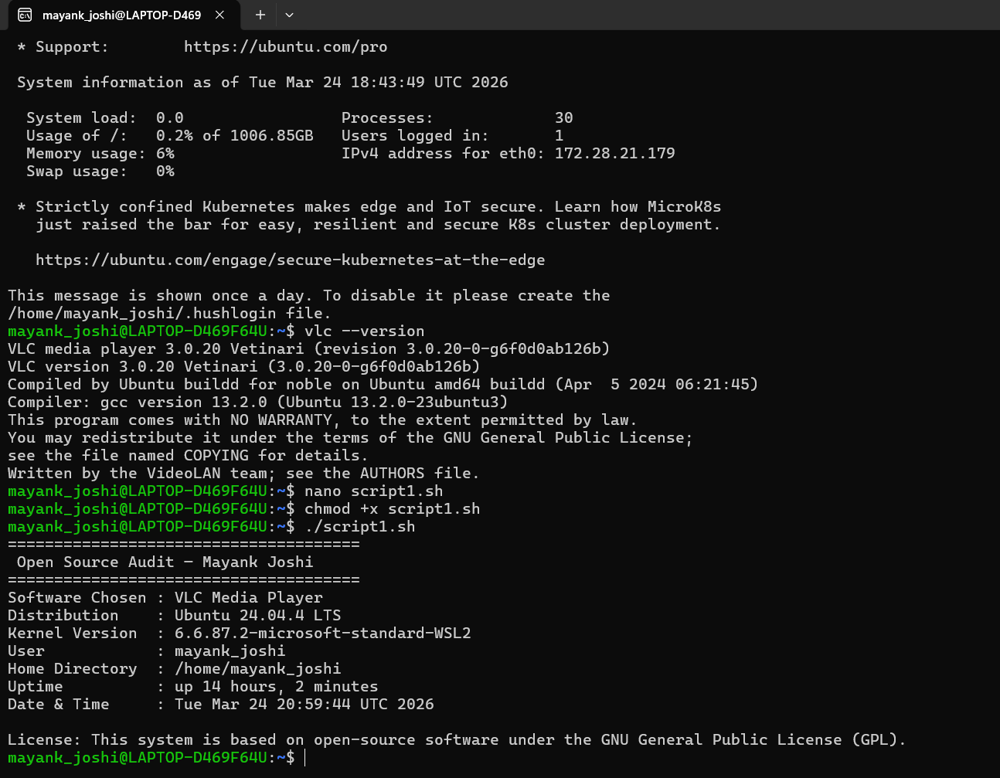
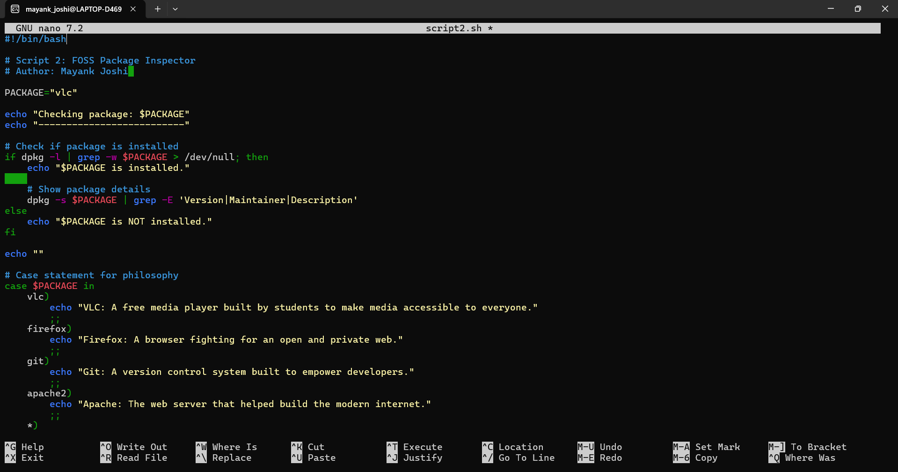
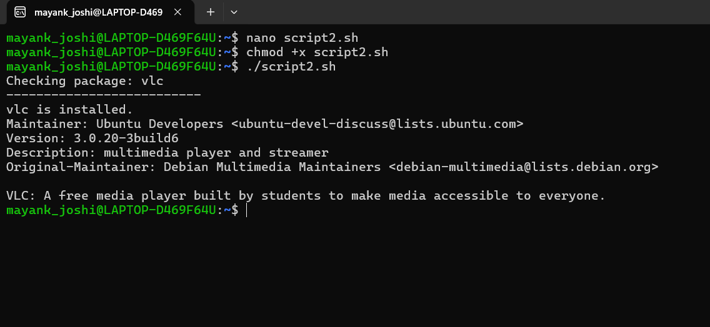
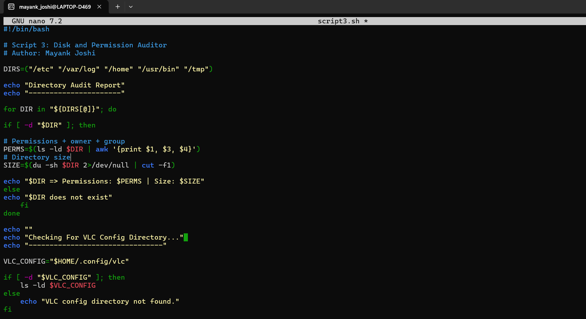
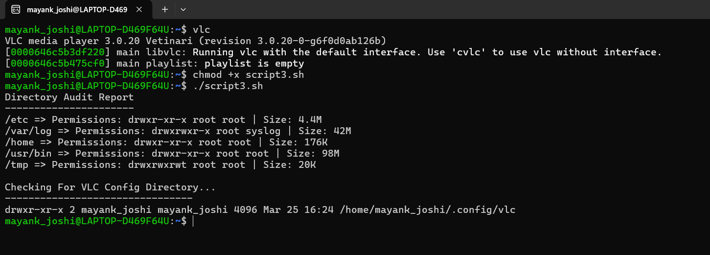
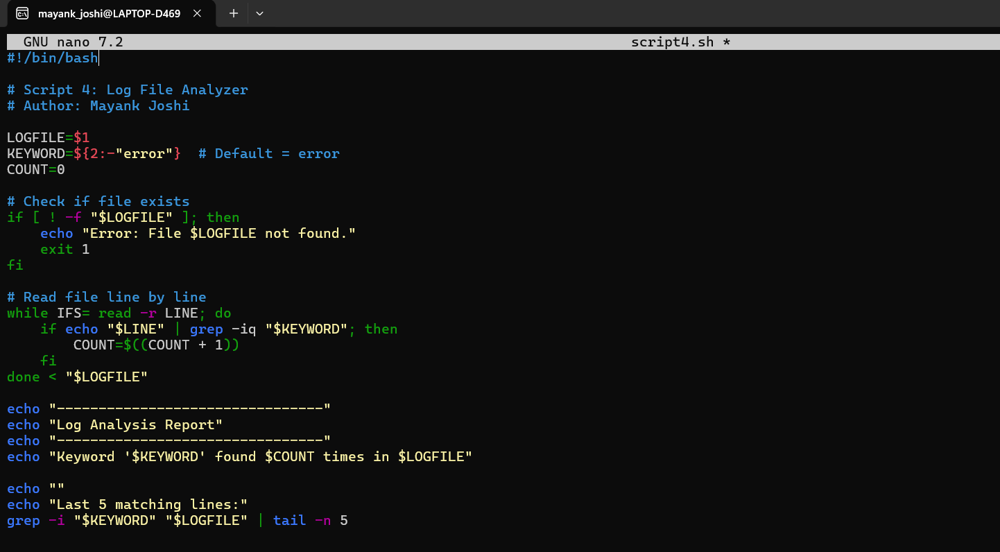
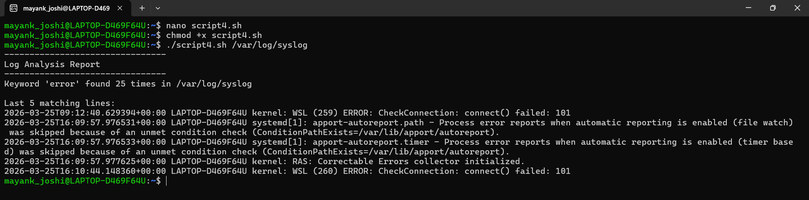
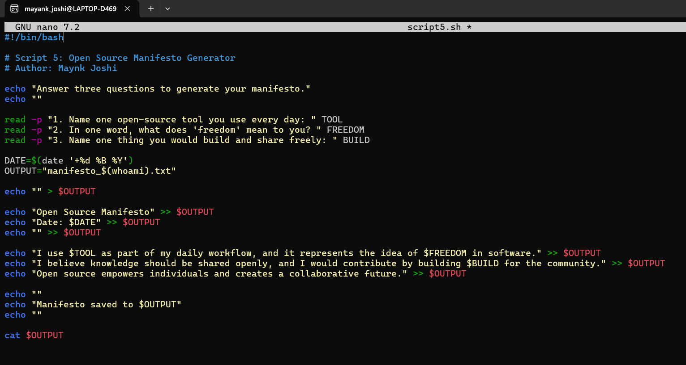
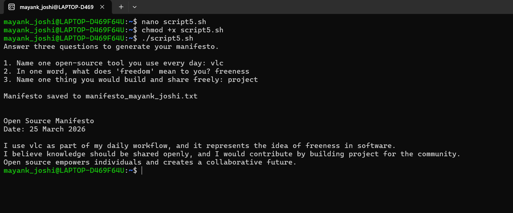

# 🎬 OSS Audit — VLC Media Player

> **Open Source Software Audit | Capstone Project**
> Course: Open Source Software (OSS NGMC) | Units 1–5

---

## 👤 Student Details

| Field | Details |
|-------|---------|
| **Student Name** | Mayank |
| **Registration Number** | 24BCE10858 |
| **Course** | Open Source Software |
| **Software Audited** | VLC Media Player |
| **License** | GNU General Public License (GPL v2+) |
| **Repository** | `oss-audit-24BCE10858-Mayank` |

---

## 📋 About This Project

This repository contains the complete Open Source Audit of **VLC Media Player** — one of the world's most widely used free and open-source multimedia players, originally built by students at École Centrale Paris in 1996 and maintained today by the non-profit **VideoLAN** organisation.

The audit covers:
- 📖 Origin story and philosophy behind VLC
- ⚖️ License analysis (GPL) and the four software freedoms
- 🧭 Ethics of open-source development
- 🐧 Linux installation footprint and system behaviour
- 🌐 FOSS ecosystem, dependencies, and community
- 🔍 Comparison with proprietary alternative (Windows Media Player)
- 🖥️ Five practical Linux shell scripts demonstrating OSS concepts

---

## 📁 Repository Structure

```
oss-audit-24BCE10858-Mayank/
│
├── README.md                            ← You are here
│
├── report/
│   └── OSS_Audit_VLC_24BCE10858.pdf    ← Full project report (12–16 pages)
│
├── script1.sh                           ← System Identity Report
├── script2.sh                           ← FOSS Package Inspector
├── script3.sh                           ← Disk and Permission Auditor
├── script4.sh                           ← Log File Analyzer
├── script5.sh                           ← Open Source Manifesto Generator
│
└── screenshots/
    ├── script1_code.png                 ← Script 1 source code
    ├── script1_output.png               ← Script 1 terminal output
    ├── script2_code.png                 ← Script 2 source code
    ├── script2_output.png               ← Script 2 terminal output
    ├── script3_code.png                 ← Script 3 source code
    ├── script3_output.png               ← Script 3 terminal output
    ├── script4_code.png                 ← Script 4 source code
    ├── script4_output.png               ← Script 4 terminal output
    ├── script5_code.png                 ← Script 5 source code
    └── script5_output.png               ← Script 5 terminal output
```

---

## 🖥️ Shell Scripts — Description, Usage & Screenshots

All scripts must be run on a **Linux system** (Ubuntu/Debian recommended).  
Make each script executable before running:

```bash
chmod +x script1.sh script2.sh script3.sh script4.sh script5.sh
```

---

### 📄 Script 1 — System Identity Report (`script1.sh`)

**Purpose:**
Displays a formatted welcome screen showing key Linux system information — distribution name, kernel version, logged-in user, home directory, system uptime, current date/time, and the open-source license governing the OS.

**Concepts Used:**
- Variables
- Command substitution `$()`
- `uname`, `whoami`, `uptime`, `lsb_release`, `date`
- Formatted `echo` output with separators

**How to Run:**
```bash
./script1.sh
```

**📸 Script 1 — Source Code**



**📸 Script 1 — Terminal Output**



---

### 📦 Script 2 — FOSS Package Inspector (`script2.sh`)

**Purpose:**
Checks whether VLC is installed on the system using `dpkg`, retrieves its version, maintainer and description, and uses a `case` statement to print a one-line open-source philosophy note based on the package name.

**Concepts Used:**
- `if-then-else`
- `case` statement with wildcard `*)`
- `dpkg -s` for package inspection
- Pipe with `grep`

**How to Run:**
```bash
./script2.sh
```

**📸 Script 2 — Source Code**



**📸 Script 2 — Terminal Output**



---

### 🗂️ Script 3 — Disk and Permission Auditor (`script3.sh`)

**Purpose:**
Loops through a list of important Linux system directories (`/etc`, `/var/log`, `/home`, `/usr/bin`, `/tmp`, `/usr/share/vlc`) and reports the permissions, owner, group, and disk usage of each. Also specifically checks for VLC's user config directory.

**Concepts Used:**
- Arrays
- `for` loop
- `ls -ld` with `awk` for field extraction
- `du -sh` for disk usage
- `-d` directory existence test
- `$HOME` variable

**How to Run:**
```bash
./script3.sh
```

**📸 Script 3 — Source Code**



**📸 Script 3 — Terminal Output**



---

### 📊 Script 4 — Log File Analyzer (`script4.sh`)

**Purpose:**
Reads a log file line by line, counts how many lines contain a specified keyword (default: `error`), prints a summary, and displays the last 5 matching lines. Accepts log file path and keyword as command-line arguments.

**Concepts Used:**
- Command-line arguments (`$1`, `$2`)
- Default values with `:-`
- File existence and empty file tests (`-f`, `-s`)
- `while IFS= read` loop
- Counter arithmetic `$(( ))`
- `grep -i` for case-insensitive search
- `tail` for last N lines

**How to Run:**
```bash
# Basic usage — default keyword is 'error'
./script4.sh /var/log/syslog

# With a custom keyword
./script4.sh /var/log/syslog warning
```

**📸 Script 4 — Source Code**



**📸 Script 4 — Terminal Output**



---

### ✍️ Script 5 — Open Source Manifesto Generator (`script5.sh`)

**Purpose:**
Interactively asks the user three questions about their relationship with open-source software, then composes a personalised philosophy statement and saves it to a `.txt` file named after the current user (`manifesto_<username>.txt`).

**Concepts Used:**
- Interactive `read -p` for user input
- String concatenation
- Writing to file with `>` (create/clear) and `>>` (append)
- `date` command for timestamps
- `$(whoami)` for dynamic filename generation
- `cat` to display the saved file

**How to Run:**
```bash
./script5.sh
```

**Output saved as:** `manifesto_mayank.txt` in current directory.

**📸 Script 5 — Source Code**



**📸 Script 5 — Terminal Output**



---

## 📸 How to Add Your Screenshots to This Repository

Follow these exact steps to upload screenshots so they display properly in this README.

### Step 1 — Capture Screenshots on Your Linux Terminal

For each script, take **two screenshots**:

| What to capture | Command to run first |
|----------------|----------------------|
| Script code | `cat script1.sh` then screenshot |
| Script output | `./script1.sh` then screenshot |

> 💡 **Tip:** Use a dark terminal theme (like the default Ubuntu terminal) for clean, professional-looking screenshots.

### Step 2 — Name Your Files Exactly As Listed Below

> ⚠️ File names are case-sensitive. Use exactly these names.

| Screenshot File Name | What It Should Show |
|----------------------|---------------------|
| `script1_code.png` | `cat script1.sh` in terminal |
| `script1_output.png` | `./script1.sh` running output |
| `script2_code.png` | `cat script2.sh` in terminal |
| `script2_output.png` | `./script2.sh` running output |
| `script3_code.png` | `cat script3.sh` in terminal |
| `script3_output.png` | `./script3.sh` running output |
| `script4_code.png` | `cat script4.sh` in terminal |
| `script4_output.png` | `./script4.sh /var/log/syslog error` output |
| `script5_code.png` | `cat script5.sh` in terminal |
| `script5_output.png` | `./script5.sh` with your answers typed in |

### Step 3 — Upload to GitHub

**Option A — GitHub Website (Easiest, No Git Needed):**

```
1. Go to: github.com/Mayank251125/oss-audit-24BCE10858-Mayank
2. Click "Add file" → "Create new file"
3. In the name box type:  screenshots/placeholder.txt
4. Add any text inside → Click "Commit changes"
   (This creates the screenshots/ folder)
5. Now click "Add file" → "Upload files"
6. Drag and drop all 10 .png files
7. Click "Commit changes"
```

**Option B — Git Terminal:**

```bash
# Inside your cloned repo folder
mkdir screenshots

# Copy all your screenshot files into it
cp ~/Desktop/script1_code.png screenshots/
cp ~/Desktop/script1_output.png screenshots/
# ... repeat for all 10 files

# Push to GitHub
git add screenshots/
git commit -m "Add screenshots for all 5 shell scripts"
git push origin main
```

### Step 4 — Verify It Works

Visit your repository on GitHub. This README will automatically display all 10 screenshots inline under their respective script sections. ✅

---

## ⚙️ Dependencies & System Requirements

| Requirement | Details |
|-------------|---------|
| **Operating System** | Ubuntu 20.04+ / Debian / Any Debian-based Linux |
| **Shell** | Bash version 4.0 or above |
| **VLC Media Player** | `sudo apt install vlc` |
| **Core Packages** | `lsb-release`, `dpkg`, `coreutils` (pre-installed on Ubuntu) |
| **Script Permissions** | `chmod +x *.sh` required before running |

### Install VLC
```bash
sudo apt update
sudo apt install vlc
```

### Verify VLC is Installed
```bash
vlc --version
```

---

## 🔬 About VLC Media Player

| Property | Details |
|----------|---------|
| **Full Name** | VLC Media Player |
| **Developer** | VideoLAN (Non-profit organisation) |
| **Origin** | École Centrale Paris, France (1996) |
| **License** | GNU General Public License v2+ (GPL) |
| **Current Version** | 3.0.20 (Vetinari) |
| **Platforms** | Windows, macOS, Linux, iOS, Android |
| **Website** | https://www.videolan.org/vlc/ |
| **Source Code** | https://code.videolan.org/videolan/vlc |
| **Total Downloads** | 5 Billion+ worldwide |

---

## 📚 Project Report Structure

The full report (`OSS_Audit_VLC_24BCE10858.pdf`) covers:

| Part | Topic | Units |
|------|-------|-------|
| **A1** | Origin of VLC — the problem it was built to solve | 1 & 2 |
| **A2** | License analysis — GPL, four freedoms, GPL vs MIT | 1 & 2 |
| **A3** | Ethics of open source — innovation, profit, community | 1 & 2 |
| **B**  | Linux footprint — installation, directories, user, services | 2 |
| **C**  | FOSS ecosystem — dependencies, community, VideoLAN | 3 & 4 |
| **D**  | Open source vs proprietary — VLC vs Windows Media Player | 5 |

---

## 🚀 Quick Start — Clone and Run Everything

```bash
# Step 1: Clone the repository
git clone https://github.com/Mayank251125/oss-audit-24BCE10858-Mayank.git

# Step 2: Enter the folder
cd oss-audit-24BCE10858-Mayank

# Step 3: Make all scripts executable
chmod +x script1.sh script2.sh script3.sh script4.sh script5.sh

# Step 4: Install VLC if needed
sudo apt update && sudo apt install vlc

# Step 5: Run scripts
./script1.sh
./script2.sh
./script3.sh
./script4.sh /var/log/syslog error
./script5.sh
```

---

## 📜 License

This project is submitted as part of the **Open Source Software (OSS NGMC)** course at **VIT Bhopal University**.

The audited software — **VLC Media Player** — is licensed under the **GNU General Public License v2 or later**. 
Full license text: https://www.gnu.org/licenses/gpl-2.0.html

---

## 🙏 Acknowledgements

- **VideoLAN & the VLC Community** — for building and maintaining one of the greatest open-source tools in history
- **GNU Project & Free Software Foundation** — for the GPL license and the philosophy of software freedom 
- **VIT Bhopal University** — for designing this course to make students think about the foundations of the software they use every day

---

*"Every tool you will use in your career — the editor, the compiler, the server, the database — was shaped by people who chose to build in the open and share their work freely."*  
*— OSS NGMC Course, VITyarthi*
